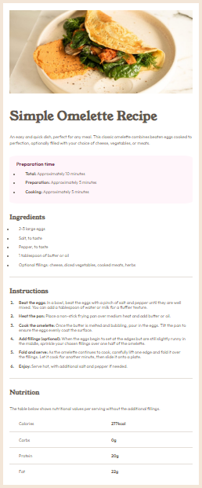

# Frontend Mentor - Recipe page solution

This is a solution to the [Recipe page challenge on Frontend Mentor](https://www.frontendmentor.io/challenges/recipe-page-KiTsR8QQKm). Frontend Mentor challenges help you improve your coding skills by building realistic projects. 

## Table of contents

- [Overview](#overview)
  - [The challenge](#the-challenge)
  - [Screenshot](#screenshot)
  - [Links](#links)
- [My process](#my-process)
  - [Built with](#built-with)
  - [What I learned](#what-i-learned)
  - [Continued development](#continued-development)
  - [Useful resources](#useful-resources)
- [Author](#author)
- [Acknowledgments](#acknowledgments)

## Overview

### Screenshot



### Links

- [Solution](https://www.frontendmentor.io/solutions/solution-using-css-flexbox-gpO56dadgb)
- [Live Site](https://pherom.github.io/recipe-page/)

## My process

First I made sure to check the images provided and to set up the structure as I understood it in the index.html file. I made sure to classify everything accordingly. I then worked on the accompanying CSS file. This work included making sure indentation is proper as well as margins and paddings and that colors and the overall design are as close as possible to the specifications.

### Built with

- Semantic HTML5 markup
- CSS custom properties
- Flexbox
- Mobile-first workflow

### What I learned

There were several tricks I had learned while trying to follow the design specifications. For example:

In order to add a border-bottom to the ```<tr>``` tag, I had to add the following:

```css
.recipe-nutrition table {
    border-collapse: collapse;
}
```
Apparently, the ```border-collapse``` property allows table cells to share borders between each other.

Also, the following CSS snippet:
```css
li::marker {
    font-weight: 700;
}
```
taught me how you can set properties for list item bullets/numbers.

### Continued development

I would love to work further on better structuring my html files with the correct semantic tags and also better positioning of content so that styling is more easily applicable and CSS files are less cluttered.
I know I need to continue working on showing an evenly distributed separation of the page's content by assigning better margins and paddings to items within it.

### Useful resources

- [Colt Steele's Web Developer Bootcamp on Udemy](https://www.udemy.com/course/the-web-developer-bootcamp/?couponCode=OF83024B) - This course taught me the fundamentals of web development and beyond.
- [Stack Overflow](https://stackoverflow.com/) - Every programmer's most handy guide

## Author

- Frontend Mentor - [@Pherom](https://www.frontendmentor.io/profile/Pherom)

## Acknowledgments

I'd like to thank Colt Steele for teaching me web development.
Check out his course on Udemy in the Useful resources section of this README.
